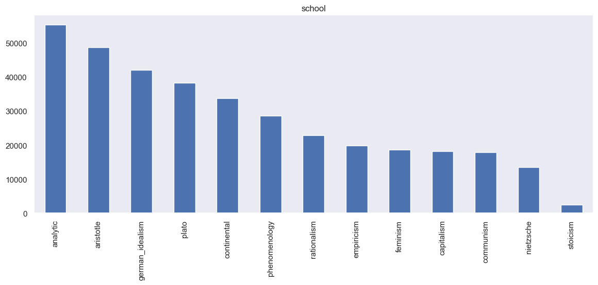

# Applied Data Science @ Columbia
## Fall 2022
## Project 1: A "data story" on the philosophy school

### [Project Description](doc/)
**Term: Fall 2022**

+ This project is conducted by Fu Wang

This is an individual project, and it will mainly focus on three different parts:

1. Visualization 
2. WordCloud
3. LDA Topic Moedling

---
**For each categorical variable (title, author, school) we will focus on the top 10 most frequent values**

**Visualization**
+ Top 10 most frequent values and how many times they have appeared in the dataset
+ Year distribution of the original published data and corpus edited date
+ Distribution of sentence length
+ BoxenPlot of sentence length corresponding to each top 10 categorical values

**WordCloud**
+ Using WordCloud to show which words are the most frequent among the given text corresponding to each top 10 categorical values (title, author, school)

**LDA Topic Moedling**

+ Finding reasonably accurate mixtures of philosophy school within a given document

